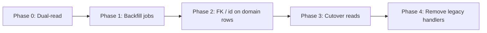

# Unified media asset migration (legacy → `media_assets`)

This document describes the **migration path** from heterogeneous legacy storage
(per-surface URLs, payloads, and attachment rows) to the **unified platform
media model** (`PlatformMediaAsset` / `public.media_assets`), including
backfill, compatibility during rollout, and retirement of legacy handlers.

**Related:** [MEDIA_DELIVERY_LAYER.md](./MEDIA_DELIVERY_LAYER.md) (delivery,
cache, lifecycle).

---

## 1. Target unified model (contract)

- **Table:** `public.media_assets` (see
  `supabase/migrations/20260121180000_tables.sql`) with JSON refs: `source_ref`,
  `original_ref`, `display_ref`, `thumbnail_ref`, `delivery_metadata`,
  `lifecycle_metadata`, `rendering_references`, etc.
- **TypeScript contract:** `PlatformMediaAsset` and related types in
  `src/lib/media/contract.ts`.
- **Normalized UI shape:** `createNormalizedAssetFromPlatformMediaAsset` in
  `src/lib/media/assets.ts` bridges contract → `NormalizedAsset` for components.

Rollout goal: **every renderable asset** should be describable as a single
`media_assets` row (or a stable FK from domain tables to `media_assets.id`),
with derivatives and delivery metadata populated.

---

## 2. Audit: legacy asset types and render paths

Authoritative **surface inventory** is maintained in code (keep TS and Node
copies in sync):

| Location                     | Purpose                                |
| ---------------------------- | -------------------------------------- |
| `LEGACY_MEDIA_SURFACE_AUDIT` | `src/lib/media/legacyCompatibility.ts` |
| Same constant                | `backend/lib/mediaMigration.js`        |

Each entry lists **asset types**, **storage buckets**, **DB fields**, **render
paths**, and **notes** for: **feed**, **chat**, **profile**, **portfolio**,
**groups**.

**Representative render entry points** (non-exhaustive; see audit arrays):

- Feed: `src/pages/feed/feedCard.tsx`, `feedCardPostContent.tsx`,
  `LinkPreviewCard.tsx`
- Chat: `AttachmentPreview.tsx`, `MessageList.tsx`
- Profile: `useProfileAssets.ts`, `ResumeCard.tsx`
- Portfolio: `ProjectPage.tsx`, `ProjectCard.tsx`, `projectMedia.ts`
- Groups: `ChatRoomHeader.tsx`, `ChatRoomRow.tsx`, `GroupsPage.tsx`

---

## 3. Legacy record kinds → unified asset mapping

**Compatibility adapter:**
`createLegacyPlatformMediaAsset(record: LegacyMediaRecord)` in
`src/lib/media/legacyCompatibility.ts` maps each legacy kind to a full
`PlatformMediaAsset`:

| `LegacyMediaRecord.kind` | Role                                                                   |
| ------------------------ | ---------------------------------------------------------------------- |
| `feed_attachment`        | Bucket-hosted feed image URL                                           |
| `gif`                    | Inline / CDN GIF URL (feed or chat surface)                            |
| `link_preview`           | Open-graph style preview (URL + optional metadata)                     |
| `portfolio_project`      | `PortfolioItem` triad (`project_url`, `image_url`, `thumbnail_url`, …) |
| `profile_resume`         | Resume URL + thumbnail sidecar                                         |
| `group_image`            | `chat_rooms.image_url`                                                 |
| `chat_attachment`        | `chat_message_attachments` + optional resolved URLs                    |

**Server-side create payload** (for DB insert / jobs):
`buildLegacyMediaAssetCreateInput(record)` in `backend/lib/mediaMigration.js` —
same kind switch, returns shapes aligned with `media_assets` columns.

---

## 4. Backfill planning (`buildLegacyMediaBackfillPlan`)

**Client:** `buildLegacyMediaBackfillPlan(record)` in `legacyCompatibility.ts`  
**Server:** `buildLegacyMediaBackfillPlan(record)` in `mediaMigration.js`

Both produce a `LegacyMediaBackfillPlan`:

| Flag                       | Meaning                                          |
| -------------------------- | ------------------------------------------------ |
| `needsAssetBackfill`       | Row should exist or be updated in `media_assets` |
| `needsDisplayBackfill`     | Missing display derivative (docs/video)          |
| `needsThumbnailBackfill`   | Missing thumbnail (doc/gif/video)                |
| `needsMetadataBackfill`    | Title/filename/provider gaps                     |
| `needsLinkPreviewBackfill` | Link preview provider/description                |
| `needsGifReprocessing`     | GIF without poster/thumbnail path                |
| `reprocessReason`          | Human-readable queue reason (GIF/doc/display)    |
| `compatibilityMode`        | `legacy_adapter` vs `ready_for_cutover`          |
| `deprecatedHandlers`       | Surface-specific code to remove after cutover    |

**GIF / document reprocessing:** Reasons include _"Legacy GIF is missing preview
derivatives…"_ and _"Legacy document preview is missing derivatives…"_ — align
with `reprocessMediaAsset` / delivery bump in
[MEDIA_DELIVERY_LAYER.md](./MEDIA_DELIVERY_LAYER.md).

---

## 5. Admin / ops API (UAT & Prod)

| Method | Route                              | Purpose                                                                                                   |
| ------ | ---------------------------------- | --------------------------------------------------------------------------------------------------------- |
| GET    | `/api/admin/media-migration/audit` | Returns `getLegacyMediaMigrationAudit()` — surfaces, rollout checklist, flattened deprecated-handler list |
| POST   | `/api/admin/media-migration/plan`  | Body = legacy `record`; returns `{ createInput, backfillPlan }` for validation in tooling                 |

**Auth:** `requireAdmin` (`backend/appCore.js`).

---

## 6. Phased rollout

| Phase                    | Behavior                                                                                                                                                                                       |
| ------------------------ | ---------------------------------------------------------------------------------------------------------------------------------------------------------------------------------------------- |
| **0 – Compatibility**    | UI keeps using legacy fields; new code paths may **also** map through `createLegacyPlatformMediaAsset` for previews or admin tools. No hard dependency on `media_assets` for every row yet.    |
| **1 – Backfill**         | Batch jobs: insert/update `media_assets`, generate thumbnails/display SVG/video posters, run `reprocess` where `backfillPlan` indicates. **Idempotent** writes (same `assetId` / stable keys). |
| **2 – Link domain data** | Add `media_asset_id` (or equivalent) on `feed_items`, attachments, `portfolio_items`, profiles, `chat_rooms`, etc., alongside legacy columns until verified.                                   |
| **3 – Cutover**          | Feature flags per surface: read **only** unified refs + `rendering_references`; legacy columns kept for rollback window.                                                                       |
| **4 – Deprecation**      | Remove handlers listed under `deprecatedHandlers` in `LEGACY_MEDIA_ROLLOUT_CHECKLIST`; drop or null legacy columns in a later schema change (coordinate with Supabase migration rules).        |

---

## 7. Surface-by-surface checklist (summary)

Full rows live in **`LEGACY_MEDIA_ROLLOUT_CHECKLIST`** (`legacyCompatibility.ts`
/ `mediaMigration.js`). Each item includes:

- **compatibilityAdapter** — what bridges legacy data today
- **backfillFocus** — ordered work items
- **cutoverTask** — when the surface is “done”
- **deprecatedHandlers** — explicit removal list after cutover

**Surfaces:** feed, chat, profile, portfolio, groups (same five as the audit).

---

## 8. Tests (regression gates)

| Suite                          | File                                          |
| ------------------------------ | --------------------------------------------- |
| Legacy mapping + backfill plan | `src/tests/media/legacyCompatibility.test.ts` |
| Backend migration helpers      | `src/tests/media/mediaMigration.test.ts`      |

Extend these when adding kinds or changing backfill rules.

---

## 9. Removal of deprecated legacy handlers (post-cutover)

When a surface’s `compatibilityMode` is consistently `ready_for_cutover` and
`media_assets` links are live:

1. Delete or feature-flag **deprecatedHandlers** listed for that surface in the
   checklist.
2. Remove **duplicate URL resolution** (e.g. ad-hoc signed URL logic where
   `rendering_references` + delivery policy suffice).
3. Keep **`createLegacyPlatformMediaAsset`** until **all** surfaces have shipped
   cutover + soak time; then narrow to historical imports only or delete unused
   branches.
4. Align **backend** `mediaMigration.js` with TS after large removals to avoid
   drift.

---

## 10. Code map (quick reference)

| Concern                        | Primary file(s)                                                            |
| ------------------------------ | -------------------------------------------------------------------------- |
| Legacy kinds + unified mapping | `src/lib/media/legacyCompatibility.ts`                                     |
| Server create input + backfill | `backend/lib/mediaMigration.js`                                            |
| Normalized asset for UI        | `src/lib/media/assets.ts`                                                  |
| Reprocess API                  | `POST /api/media/assets/:assetId/reprocess`, `backend/lib/mediaService.js` |
| Delivery / invalidation        | `src/lib/media/delivery.ts`                                                |

---

## 11. Compatibility during migration (principles)

- **Do not** break render paths that still read legacy columns mid-rollout; use
  dual-read or adapter at boundaries.
- **Prefer** stable asset IDs and `bumpPlatformMediaDeliveryVersion` when
  replacing derivatives so caches invalidate cleanly.
- **Telemetry:** legacy mapping sets `telemetry.pipeline = 'legacy_migration'` /
  `stage = 'compatibility_adapter'` where applicable — keep for observability
  until Phase 4.
